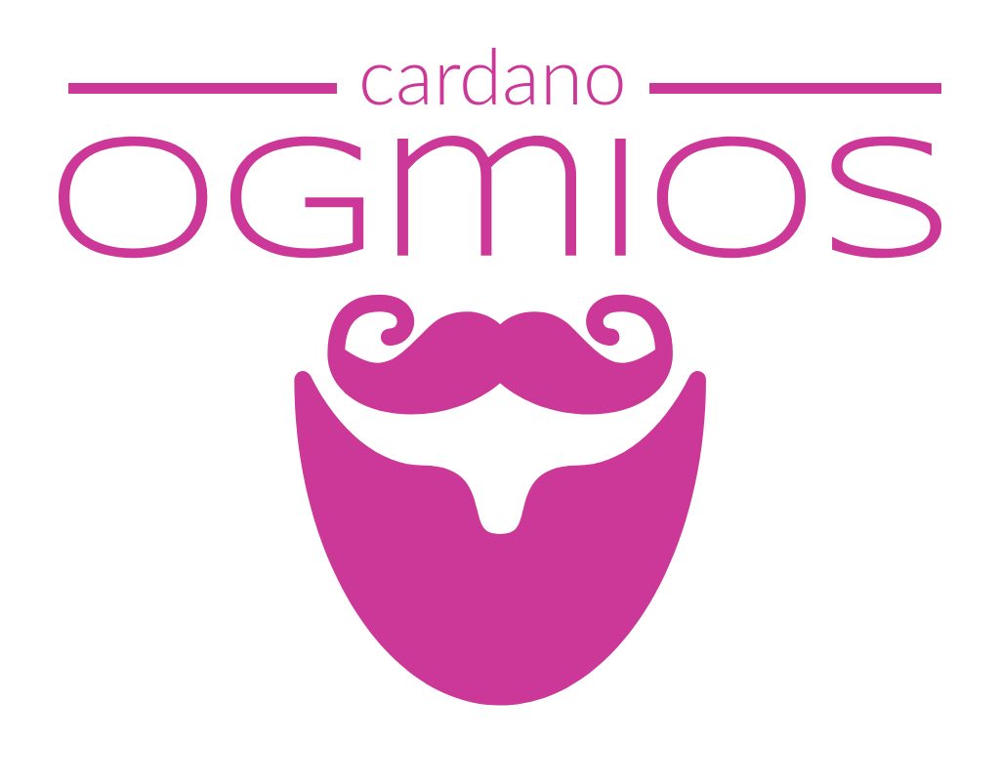

  

    

**Ogmios** is a translation service written in Haskell running on top of [cardano-node](https://github.com/input-output-hk/cardano-node/). It offers a [JSON-WSP](https://en.wikipedia.org/wiki/JSON-WSP) interface through WebSockets and enables clients to speak [Ouroboros' mini-protocols](https://hydra.iohk.io/build/1070091/download/1/network.pdf#chapter.3) via remote procedure calls over JSON. Ogmios is very lightweight too and can be deployed alongside relays to create entry points on the Cardano network for various type of applications (e.g. wallets, explorers, chatbots, dashboards...).

  <a href="https://ktorz.github.io/cardano-ogmios">:book: User Manual</a>
  |
  <a href="CONTRIBUTING.md">:gift: Contributing</a>
  |
  <a href="CHANGELOG.md">:floppy_disk: Changelog</a>

