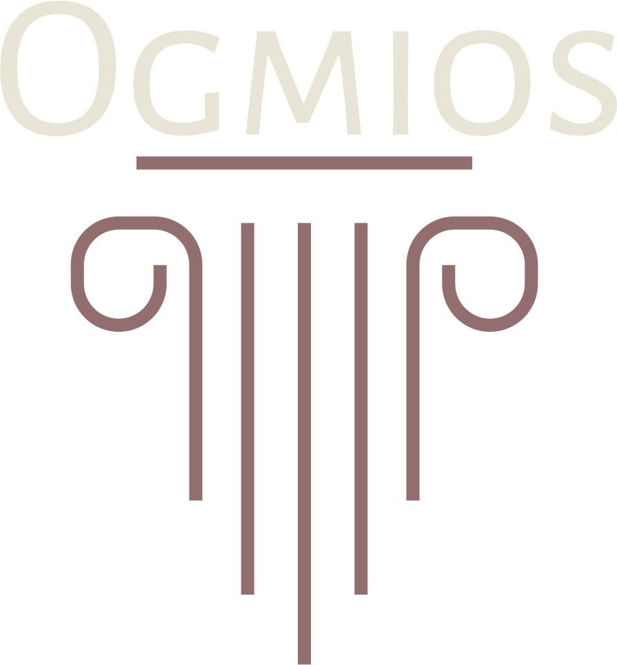
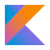
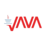
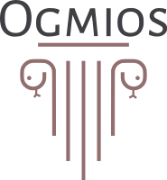
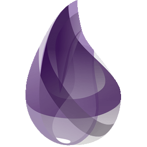
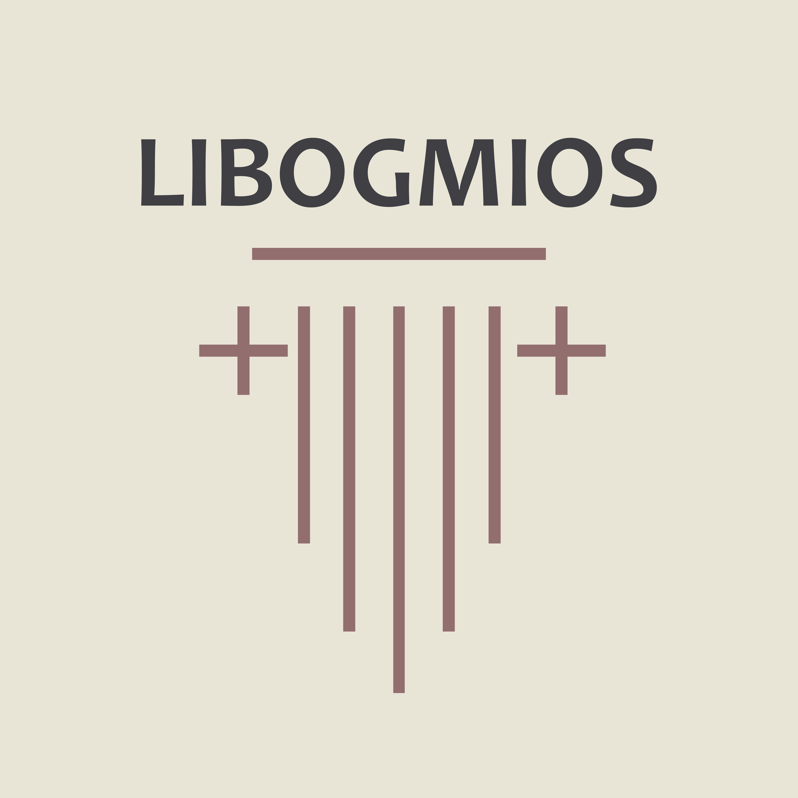
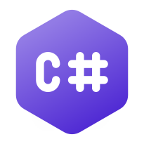

<p align="center">
<a href='https://github.com/cardanosolutions/ogmios/actions?query=workflow%3A"Continuous Integration"'></a> <a href='https://github.com/cardanosolutions/ogmios/actions?query=workflow%3A"User Guide"'></a> <a href='https://github.com/cardanosolutions/ogmios/actions?query=workflow%3A"Network Synchronization"'></a>
<br/>

<p align="center">
  <picture>
    <source media="(prefers-color-scheme: light)" srcset="./branding/ogmios__light.png">
    
  </picture>
</p>

**Ogmios** is a lightweight bridge interface for [cardano-node](https://github.com/intersectMBO/cardano-node/). It provides an **HTTP / WebSocket** API that enables applications to interact with a local cardano-node via **JSON+RPC-2.0**.

## Compatibility

 | Ogmios       | Cardano-node (mainnet, preview, preprod) |
 | ---          | ---                                      |
 | **`v6.10.*`** | **`10.1.3`**                             |
 | `v6.9.*`     | `10.1.2`                                 |
 | `v6.8.*`     | `9.2.0`, `9.1.1`                         |
 | `v6.7.*`     | `9.2.0`, `9.1.1`                         |
 | `v6.6.*`     | `9.1.1`                                  |
 | `v6.5.*`     | `9.0.0`, `9.1.0`                         |
 | `v6.4.*`     | `8.9.3`                                  |
 | `v6.3.*`     | `8.9.2`                                  |
 | `v6.2.*`     | `8.9.0`                                  |
 | `v6.1.*`     | `8.7.3`                                  |
 | `v5.6.*`     | `1.35.4`, `1.35.7`                       |

[SanchoNet]: https://sancho.network/

## QuickStart

Using [Homebrew](https://brew.sh/):

```
brew tap CardanoSolutions/formulas
brew install ogmios
```

See our [Ogmios client starter kit](https://github.com/CardanoSolutions/ogmios-ts-client-starter-kit#ogmios-client-starter-kit) or jump right into the [user manual](https://ogmios.dev).

## Features

<table align="center">
  <tr><td>Fast synchronization of blocks from the Cardano network(s)</td><td><a href="https://ogmios.dev/mini-protocols/local-chain-sync/" target="_blank">↗️</a></td></tr>
  <tr><td>Transaction submission with enhanced error messages</td><td><a href="https://ogmios.dev/mini-protocols/local-tx-submission/#submittx" target="_blank">↗️</a></td></tr>
  <tr><td>Evaluation of Plutus script execution units</td><td><a href="https://ogmios.dev/mini-protocols/local-tx-submission/#evaluatetx" target="_blank">↗️</a></td></tr>
  <tr><td>Local mempool monitoring</td><td><a href="https://ogmios.dev/mini-protocols/local-tx-monitor/" target="_blank">↗️</a></td></tr>
  <tr>
  <td>
  State queries<br/>
  <details><summary>Network</summary>

  queryNetwork                 | Information
  ---                          | ---
  `blockHeight`                | The chain's highest block number.
  `genesisConfiguration`       | Get the genesis configuration of a specific era.
  `startTime`                  | The chain's start time (UTC).
  `tip`                        | The network's current tip.
  </details>
  <details><summary>Ledger</summary>

  queryLedgerState             | Information
  ---                          | ---
  `constitution`               | The current on-chain constitution.
  `constitutionalCommittee`    | A complete summary of the constitutional committee.
  `epoch`                      | The current epoch of the ledger.
  `eraStart`                   | The information regarding the beginning of the current ledger era.
  `eraSummaries`               | Era bounds and slot parameters details, required for proper slotting arithmetic.
  `governanceProposals`        | Currently active governance proposals and their ratification state (i.e. votes).
  `liveStakeDistribution`      | Distribution of the stake across all known stake pools, relative to the **total** stake in the network.
  `projectedRewards`           | The projected rewards of an account in a context where the top stake pools are fully saturated. This projection gives, in principle, a ranking of stake pools that maximizes delegator rewards.
  `protocolParameters`         | The current protocol parameters.
  `proposedProtocolParameters` | The last update proposal w.r.t. protocol parameters, if any.
  `rewardAccountSummaries`     | Current delegation settings and rewards of chosen reward accounts.
  `rewardsProvenance`          | Get details about rewards calculation for the ongoing epoch.
  `stakePools`                 | The list of all pool identifiers currently registered and active.
  `tip`                        | The current tip the ledger is at. Said differently, the slot number and header hash of the last block that has been processed by the ledger.
  `treasuryAndReserves`        | The Ada value of the treasury and reserves of the protocol.
  `utxo`                       | Current UTXO, possibly filtered by output reference.
  </details>
  </td>
  <td>
    <a href="https://ogmios.dev/mini-protocols/local-state-query/" target="_blank">↗️</a>
  </td>
  </tr>
  <tr><td>Dual WebSocket/HTTP support</td><td><a href="https://ogmios.dev/getting-started/basics" target="_blank">↗️</a></td></tr>
  <tr><td>Structured JSON logging</td><td><a href="https://ogmios.dev/getting-started/monitoring/" target="_blank">↗️</a></td></tr>
  <tr><td>Health monitoring, with runtime and application statistics</td><td><a href="https://ogmios.dev/getting-started/monitoring/" target="_blank">↗️</a></td></tr>
</table>

> [!TIP]
>
> Test vectors that cover every part of the protocol are [available here](https://github.com/CardanoSolutions/ogmios/tree/master/server/test/vectors). Use them without moderation for a smooth integration!

# Roadmap

### Cutting-edge work

The project keeps a [changelog 💾](./CHANGELOG.md) in which all past changes and _recent-but-not-yet-released_ changes can be seen. Changes in the changelog have been implemented and are available in latest builds from the `master` branch.

### Planned work

The [github issues & milestones 🎯][milestones] list planned tasks that haven't been implemented but have reached enough maturity to be well-defined and scoped. Milestones have end-dates to give a broad estimate of when it is expected.

### Future work

Finally, [discussions 💡][discussions] contains ongoing discussions regarding the future of Ogmios, with design decisions still under consideration.

## Clients / SDKs

Ogmios provides a language-agnostic API which can be implemented using any WebSocket or HTTP client. If you prefer using a SDK in your favorite language, see below the available clients (_maintained by the community_):

<table align="center"><thead><tr>
<td align="center"><br/><a href="https://ogmios.dev/typescript/api/modules/_cardano_ogmios_client.html"><strong>TypeScript</strong></a></td>
<td align="center"><br/><a href="https://github.com/savaki/ogmigo/#readme"><strong>Go</strong></a></td>
<td align="center"><br/><a href="https://github.com/projectNEWM/kogmios#readme"><strong>Kotlin</strong></a></td>
<td align="center"><br/><a href="https://github.com/adabox-aio/ogmios-java-client.git#readme"><strong>Java</strong></a></td>
<td align="center"><br/><a href="https://ogmios-python.readthedocs.io/en/latest/examples/index.html"><strong>Python</Strong></a></td>
<td align="center"><br/><a href="https://github.com/wowica/xogmios"><strong>Elixir</Strong></a></td>
<td align="center"><br/><a href="https://gitlab.com/viperscience/libogmios"><strong>C++</Strong></a></td>
<td align="center"><br/><a href="https://github.com/ItsDaveB/OgmiosDotnet"><strong>C#</Strong></a></td>
</tr><thead></table>

## Sponsors

A big thank to [all our sponsors 💖](https://github.com/CardanoSolutions#-sponsors).

<hr/>

<p align="center">
  <a href="https://cardanosolutions.github.io/ogmios">:book: User Manual</a>
  |
  <a href="CONTRIBUTING.md">:triangular_ruler: Contributing</a>
  |
  <a href="CHANGELOG.md">:floppy_disk: Changelog</a>
  |
  <a href="https://discord.gg/zMr6EGvBpr">Discord (#ogmios)</a>
  |
  <a href="https://twitter.com/_KtorZ_"> Twitter (@_KtorZ_)</a>
</p>

<p align="center">
  Need more information? Have a look at the <a href="https://ogmios.dev/faq/" alt="F.A.Q">Frequently Asked Questions</a>.
</p>

<p align="center"><a href="https://github.com/cardanosolutions/ogmios/blob/master/LICENSE"></a></p>

[discussions]: https://github.com/CardanoSolutions/ogmios/discussions/categories/ideas-feature-requests?discussions_q=sort%3Atop+category%3A%22Ideas+%2F+Feature+Requests%22
[milestones]: https://github.com/CardanoSolutions/ogmios/milestones
