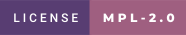

    
  </table>

  

### Overview

**Ogmios** is a lightweight bridge interface of [cardano-node](https://github.com/input-output-hk/cardano-node/). It offers a WebSockets API that enables local clients to speak [Ouroboros' mini-protocols](https://hydra.iohk.io/build/1070091/download/1/network.pdf#chapter.3) via JSON/RPC.

### Features

- Fast synchronization of blocks from the Cardano network
- Full ledger state query support:
  - `currentEpoch`
  - `eraStart`
  - `ledgerTip`
  - `nonMyopicMemberRewards`
  - `delegationsAndRewards`
  - `currentProtocolParameters`
  - `proposedProtocolParameters`
  - `stakeDistribution`
  - `utxo`
  - `genesisConfig`
- Transaction submission with enhanced error messages
- TypeScript client & REPL
- Structured JSON logging 
- Health monitoring (with runtime and application statistics)
- Supports for all Cardano networks (mainnet, testnet, staging...)
- Fully documented API with JSON-schema

### Preview

  

  <a href="https://cardanosolutions.github.io/ogmios">:book: User Manual</a>
  |
  <a href="CONTRIBUTING.md">:triangular_ruler: Contributing</a>
  |
  <a href="SPONSORS.md">:gift_heart: Sponsors</a>
  |
  <a href="CHANGELOG.md">:floppy_disk: Changelog</a>

