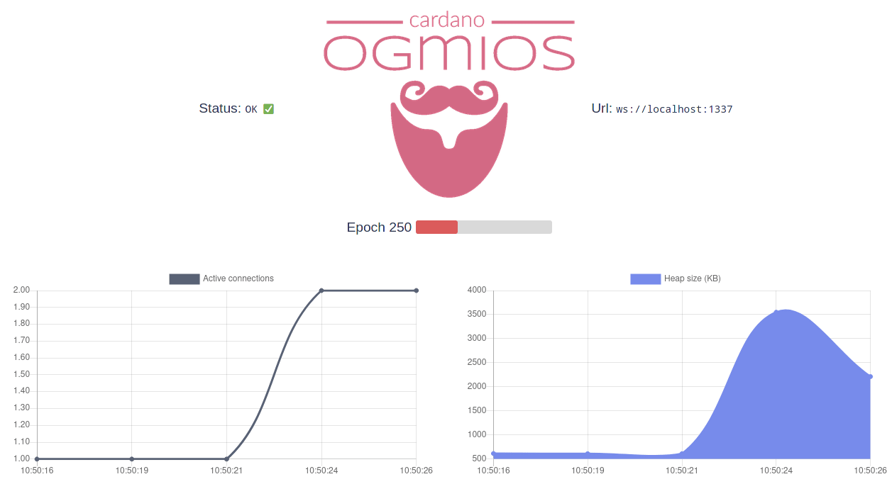
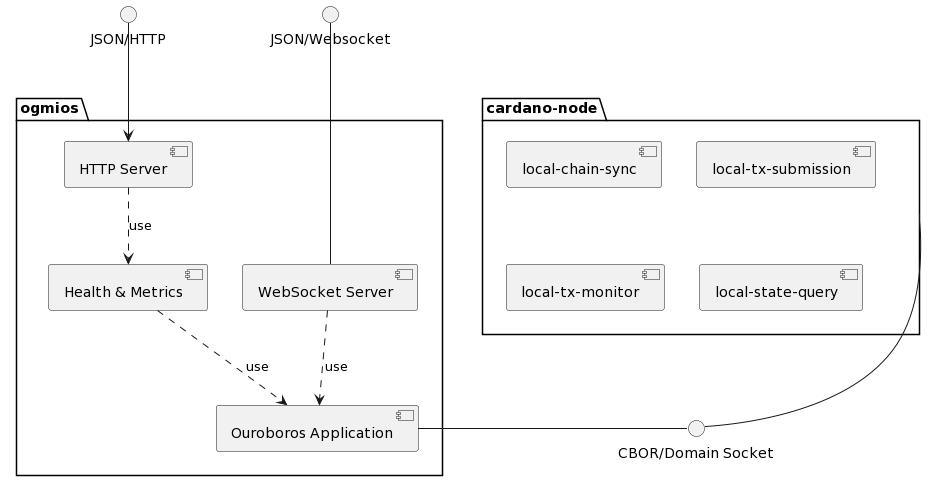

# Ogmios (Server)



## Synopsis

Ogmios is a webserver which acts as a proxy for talking to a cardano-node. Upon request, it establishes a node-to-client 
connection with a Cardano node and forward messages from a client application to the node (and vice-versa). Ogmios aims to be
_as capable as_ a Cardano node (w.r.t. node-to-client protocols). Yet, since the internals are statically typed, new additions
in the node (e.g. new queries) needs to be mapped correctly internally and, translated as JSON.

Ogmios does a little more than that, as it offers also some monitoring capabilities and embeds an HTTP server. 

## Architecture

Ogmios is constructed as a [three-layer Haskell cake](https://www.parsonsmatt.org/2018/03/22/three_layer_haskell_cake.html), which 
aims at being a simple and maintainable architecture for Haskell applications. Effects are separated from the business logic, and the
entire application is stitched together in a very thin layer. 

<!-- RP11Rp8X48Rl_8g9X--6th-3qQg9RLHQsMOFnWEoKoNkWWMsgMdwtxk0crtJtc2UPuRXdJWlhA-haYZjqRu9YJ1uucmpol7WZ3oZ7u1my9ZpNyOoovuJ3AS-dZsmxMXkAg4qyDwGEIVa8kHP71l972jbt02-2C0kJ02EzWFjFgZX7khD5cb07-Oyjg0e_Gd-mHgzLTAbliLqbIq3PhKr1sEDW-dbKYefl38wEknrove56OV6YmyFX-DRvt-e7JRbd8TYfxRrPFtDOWn0wRZTldk8nhz3YB4HQFf1EEzEgYXGxorjDo3VX6pOV77h8IJbTAy6eHUb5BOGsb1j2Wn9Hvw2BOqK9PKdeJHrLorZ0giPxvZ_fAu-LCgvDg1LTeyhevKtziRM7NDUUAJlDTfhWlmbh3z1NTHL-GC0 -->


### Modules Overview

##### Top-Level

Where top-level code lies, stitching together the various parts of the applications and exposing a high-level interface for building an executable.

<details>
  <summary>Modules</summary>

```tree
             ^  ─── Ogmios.hs
             |      ├── Options.hs
Application  |      ├── Prelude.hs
             v      └── Version.hs
```
</details>

##### Data

Contains data-structures and non-effectful code. Since Ogmios is mainly a codec translation layer, this is where most of the code (75%) lies. In particular, all the JSON encoders and decoders are defined here, as well as the JSON-WSP machinery behind all requests and responses.

<details>
  <summary>Modules</summary>

```tree
             ^  ─── Data
             |       ├── EraTranslation.hs
             |       ├── Health.hs
             |       ├── Json.hs
             |       ├── Json
             |       │   ├── Prelude.hs
             |       │   ├── Orphans.hs
             |       │   ├── Query.hs
             |       │   ├── Byron.hs
             |       │   ├── Shelley.hs
             |       │   ├── Allegra.hs
             |       │   ├── Mary.hs
             |       │   ├── Alonzo.hs
       Data  |       │   └── Babbage.hs
             |       ├── Metrics.hs
             |       ├── Protocol.hs
             |       └── Protocol
             |           ├── ChainSync.hs
             |           ├── StateQuery.hs
             |           ├── TxMonitor.hs
             v           └── TxSubmission.hs
```
</details>

##### App

Effectful code written leveraging Haskell's type-class as an effect system. This is where the client-side (where cardano-node acts as a server) implementation of ouroboros mini-protocols resides. This is also where we define the HTTP server and WebSocket server handlers. 

<details>
  <summary>Modules</summary>

```tree
             ^  ─── App
             |      ├── Health.hs
             |      ├── Metrics.hs
             |      ├── Configuration.hs
             |      ├── Protocol.hs
             |      ├── Protocol
             |      │   ├── ChainSync.hs
      Logic  |      │   ├── StateQuery.hs
             |      │   ├── TxMonitor.hs
             |      │   └── TxSubmission.hs
             |      ├── Server.hs
             |      └── Server
             |          ├── Http.hs
             |          └── WebSocket.hs
             v
```
</details>

##### Control

A thin abstraction layer for I/O effects. This is based off [io-sim](https://github.com/input-output-hk/io-sim) with a few additions custom to Ogmios. The goal of these modules isn't to be a generic all-purpose I/O abstraction, but rather, something tailored to the project, that defines a clear interface for effects and that encapsulate their actual interpretation in one place. This allows for the rest of the code to remains mostly IO-free.

<details>
  <summary>Modules</summary>

```tree
             ^  ─── Control
             |      ├── Exception.hs
             |      ├── MonadAsync.hs
             |      ├── MonadClock.hs
    Effects  |      ├── MonadLog.hs
             |      ├── MonadMetrics.hs
             |      ├── MonadOuroboros.hs
             |      ├── MonadSTM.hs
             v      └── MonadWebSocket.hs
```
</details>
